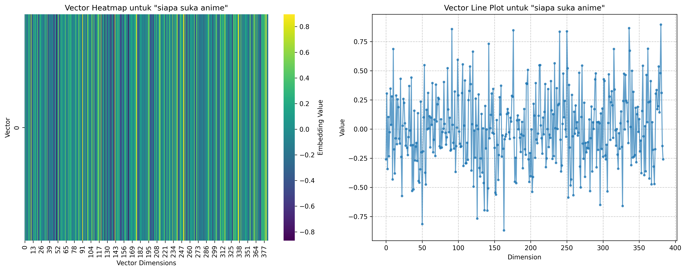
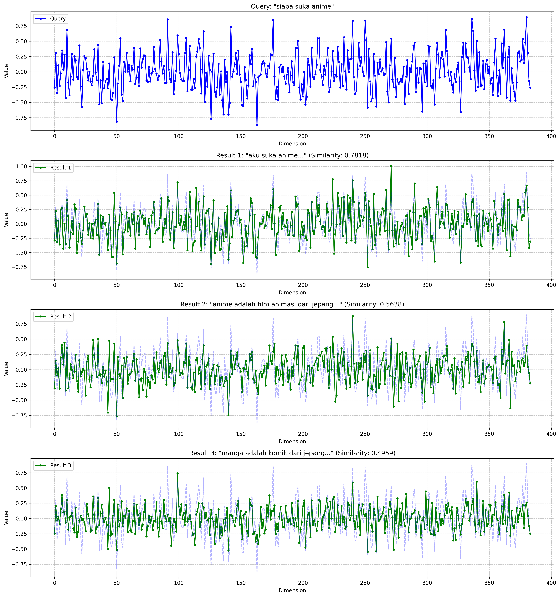
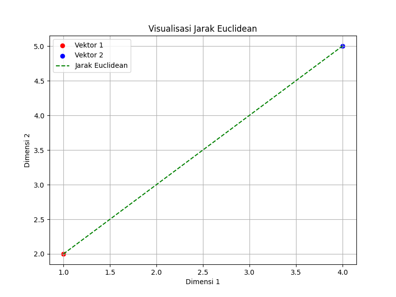

# RAG Base Concept

## 📌 Deskripsi
Proyek ini mengimplementasikan **Retrieval-Augmented Generation (RAG)** menggunakan **embedding-based retrieval** dengan model transformer. Selain melakukan pencarian semantik berbasis **cosine similarity**, proyek ini juga menyediakan **visualisasi embedding** untuk memahami perbedaan dan hubungan antar vektor dokumen.

## 🚀 Fitur
✅ **Ekstraksi embedding teks** menggunakan model transformer.

✅ **Pencarian semantik** berbasis **cosine similarity**.

✅ **Visualisasi embedding** dalam bentuk heatmap dan plot garis.

✅ **Perbandingan embedding query vs hasil retrieval**.

✅ **Visualisasi Euclidean Distance** antar vektor.

## 🏗️ Struktur Proyek
```
C:.
│   .gitignore
│   embedding.py
│   euclidean_distance.png
│   requirements.txt
│   visualize.py
│   visualize2.py
│
└───visualizations
        dokumen_1.png
        dokumen_2.png
        dokumen_3.png
        dokumen_4.png
        dokumen_5.png
        perbandingan_query_hasil.png
        query.png
```

## 📚 Instalasi
Sebelum menjalankan proyek ini, pastikan Python telah terinstal. Lalu, jalankan perintah berikut untuk menginstal dependensi:
```sh
pip install -r requirements.txt
```

## 📌 Cara Penggunaan

### 1️⃣ Menjalankan Embedding dan Pencarian Semantik
Jalankan **embedding.py** untuk menguji sistem retrieval berbasis cosine similarity:
```sh
python embedding.py
```

### 2️⃣ Visualisasi Embedding
Kode dalam `embedding.py` akan menghasilkan beberapa visualisasi embedding dokumen dan query. Berikut adalah salah satu contoh visualisasi vektor hasil embedding:



### 3️⃣ Perbandingan Query dengan Hasil Retrieval
Hasil pencarian berdasarkan **cosine similarity** divisualisasikan untuk menunjukkan perbedaan embedding antara query dan hasil retrieval:



## 🔬 Penjelasan Perhitungan Cosine Similarity
Sistem menggunakan **cosine similarity** untuk mengukur kedekatan vektor embedding:

```math
\text{Cosine Similarity} = \frac{A \cdot B}{||A|| \times ||B||}
```

Dimana:
- $A$ dan $B$ adalah vektor embedding dari teks.
- $A \cdot B$ adalah **dot product** antara kedua vektor.
- $||A||$ dan $||B||$ adalah panjang (magnitude) masing-masing vektor.

Implementasi dalam Python menggunakan **scikit-learn**:
```python
from sklearn.metrics.pairwise import cosine_similarity
similarity = cosine_similarity([query_embedding], document_embeddings)[0]
```

## 🔢 Perhitungan Dot Product
Dot product dari dua vektor \( A \) dan \( B \) dihitung sebagai berikut:

```math
A \cdot B = \sum_{i=1}^{n} A_i B_i
```

Dimana:
- $A_i$ dan $B_i$ adalah komponen ke- $i$ dari masing-masing vektor.
- $n$ adalah jumlah dimensi vektor.

Implementasi dalam Python:
```python
import numpy as np
A = np.array([1, 2, 3])
B = np.array([4, 5, 6])
dot_product = np.dot(A, B)
print(dot_product)  # Output: 32
```

## 📊 Visualisasi Euclidean Distance
Selain cosine similarity, proyek ini juga menampilkan **Euclidean Distance** untuk membandingkan vektor embedding:

```math
d(A, B) = \sqrt{\sum_{i=1}^{n} (A_i - B_i)^2}
```

Berikut adalah visualisasi jarak Euclidean antara dua vektor:



## 🔧 Pengembang
Proyek ini dibuat sebagai bagian dari eksperimen dalam penerapan **RAG (Retrieval-Augmented Generation)** dan **visualisasi embedding**.

📌 **Lisensi:** MIT
